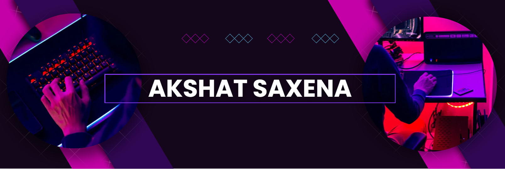

<h1 align="center">Hi 👋, I'm Akshat Saxena</h1>
<h3 align="center">A passionate Software Developer from India</h3>

</img> 

  

- 👨‍💻 All of my projects are available at [ Portfolio Link ](https://akshat-portfolio-website.onrender.com)

- 📫 How to reach me **akshatji21052003@gmail.com**

- 📄 Know about my experiences [ Resume link ](https://drive.google.com/file/d/1PmkCeiw56T5qK1lB9XacM6iCKaIm_0uQ/view?usp=drive_link)

- ⚡ Fun fact **I Love Cold Coffee 😋**
 
<h3 align="left">Connect with me:</h3>

 
<h3 align="left">Languages and Tools:</h3>

                                          

  

  
  
  

<picture>
  <source media="(prefers-color-scheme: dark)" srcset="https://raw.githubusercontent.com/GitHub-Akshat/GitHub-Akshat/output/github-contribution-grid-snake-dark.svg">
  <source media="(prefers-color-scheme: light)" srcset="https://raw.githubusercontent.com/GitHub-Akshat/GitHub-Akshat/output/github-contribution-grid-snake.svg">
  
</picture>
